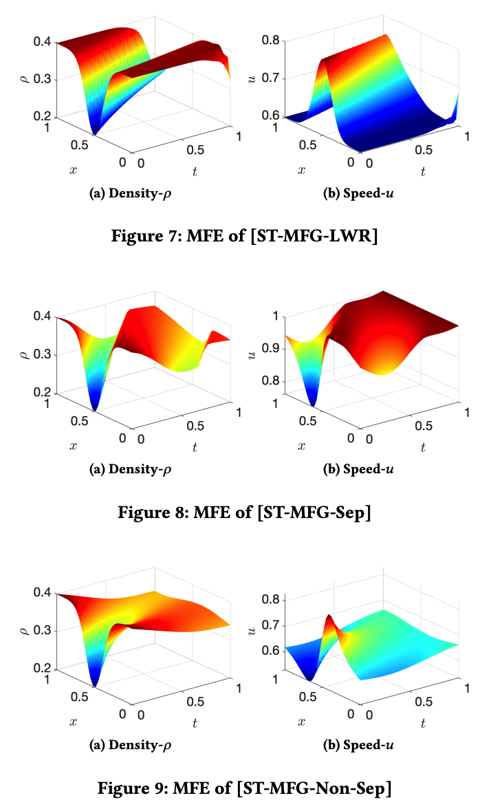

# MFG-RL-PIDL

We formulate the Spatiotemporal Mean Field Games to value iteration expression and use DDPG and residual networks to solve the system dynamics. We apply this method to the traffic ringroad with 3 different reward functions, obtaining the following results: 



Our conference paper "A Hybrid Framework of Reinforcement Learning and Physics-Informed Deep Learning for Spatiotemporal Mean Field Games" has been published in AAMAS 2023. If you find it helpful, please cite it.

```
@inproceedings{chen2023hybrid,
  title={A Hybrid Framework of Reinforcement Learning and Physics-Informed Deep Learning for Spatiotemporal Mean Field Games},
  author={Chen, Xu and Liu, Shuo and Di, Xuan},
  booktitle={Proceedings of the 2023 International Conference on Autonomous Agents and Multiagent Systems},
  pages={1079--1087},
  year={2023}
}
```

## How to Run

```
python MFG.py # hyperparams set by default
```
